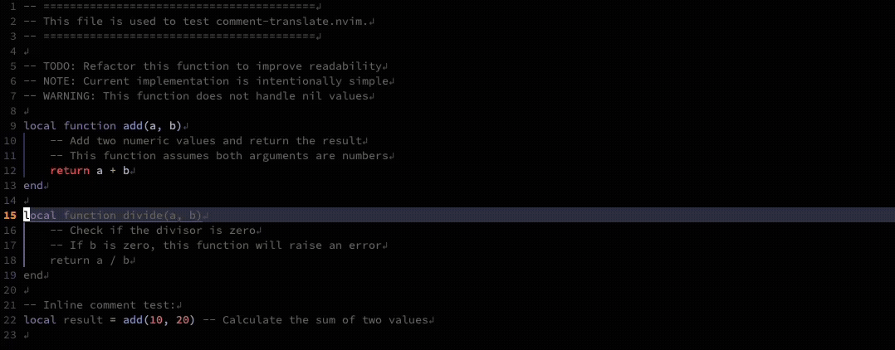

# comment-translate.nvim

Translate comments and strings in code to understand multilingual codebases without leaving Neovim.

## Features


* **Hover Translation**: Display translations when hovering over comments or strings
* **Immersive Translation**: Automatically translate and display comments inline in the buffer
* **Replace Translation**: Replace selected text with its translation
* **Tree-sitter aware**: Accurate detection of comments and strings

## Quick Start

1. Install the plugin using your preferred plugin manager.
2. Open a file containing comments or strings.
3. Hover over a comment or string to see the translation.

## Usage

### Hover Translation

When you hover over a comment or string, the translation appears in a popup.

**Timing**: The popup appears after `updatetime` (default 4000ms) plus `hover.delay`.

```lua
vim.opt.updatetime = 300

require('comment-translate').setup({
  hover = { delay = 200 },
})
```

### Immersive Translation

Run `:CommentTranslateToggle` to translate and display all comments inline.

Immersive mode is **global** and applies to all buffers until disabled.

### Replace Selected Text

Select text in visual mode and run `:CommentTranslateReplace` to replace it with the translation.

## Requirements

* Neovim 0.8+
* [plenary.nvim](https://github.com/nvim-lua/plenary.nvim) (required)
* [nvim-treesitter](https://github.com/nvim-treesitter/nvim-treesitter) (recommended)
* `curl` command
* Internet connection

## Installation

### lazy.nvim

```lua
{
  'noir4y/comment-translate.nvim',
  dependencies = {
    'nvim-lua/plenary.nvim',
    'nvim-treesitter/nvim-treesitter',
  },
  config = function()
    require('comment-translate').setup({
      target_language = 'ja',
    })
  end,
}
```

### packer.nvim

```lua
use {
  'noir4y/comment-translate.nvim',
  requires = {
    'nvim-lua/plenary.nvim',
    'nvim-treesitter/nvim-treesitter',
  },
  config = function()
    require('comment-translate').setup({
      target_language = 'ja',
    })
  end,
}
```

## Configuration

```lua
require('comment-translate').setup({
  target_language = 'ja',  -- Target language (default: auto-detected from system locale, fallback 'en')
  translate_service = 'google',  -- Currently only 'google' is supported
  hover = {
    enabled = true,  -- Enable hover translation
    delay = 500,  -- Additional delay (ms) after CursorHold before showing hover
    auto = true,  -- If false, disable auto-hover and use explicit keymap
  },
  immersive = {
    enabled = false,  -- Enable immersive translation on startup
  },
  cache = {
    enabled = true,  -- Enable translation cache
    max_entries = 1000,  -- Maximum cache entries
  },
  max_length = 5000,  -- Maximum translation text length
  targets = {
    comment = true,  -- Include comments as translation targets
    string = true,  -- Include strings as translation targets
  },
  keymaps = {
    hover = '<leader>th',  -- Hover translation
    hover_manual = '<leader>tc',  -- Manual hover trigger (when auto is disabled)
    replace = '<leader>tr',  -- Replace selected text with translation
    toggle = '<leader>tt',  -- Toggle immersive translation ON/OFF (global)
  },
})
```

### Configuration Notes

* **target_language**: Automatically detected from system locale (`LANG`, `LANGUAGE`, `LC_ALL`) or Vim language settings. Falls back to `'en'` if detection fails.
* **hover.delay**: Applied after the `CursorHold` event. Total delay is `updatetime` (Neovim option) plus `hover.delay`.

## Commands

* `:CommentTranslateHover` — Display translation under cursor
* `:CommentTranslateHoverToggle` — Toggle auto hover on/off
* `:CommentTranslateReplace` — Replace selected text with translation
* `:CommentTranslateToggle` — Toggle immersive translation globally
* `:CommentTranslateUpdate` — Update immersive translation for current buffer
* `:CommentTranslateSetup` — Setup plugin with default settings
* `:CommentTranslateHealth` — Health check (`:checkhealth comment-translate`)

## Privacy / Data Handling

This plugin prioritizes transparency. To provide real-time translation, text is sent to an external translation service.

* **External transmission**: Translation uses the unofficial Google Translate HTTP endpoint (`translate.googleapis.com`) via `curl`.
* **What is sent**: The selected text or detected comment/string content. If it contains **personal data**, **credentials**, **internal code**, or other sensitive information, it may be transmitted outside your environment.
* **Cache behavior**: The built-in cache is **in-memory only**. No files are written by the plugin, and the cache is cleared when Neovim exits.
* **Control**: Automatic hover translation can be disabled, and all translation features are user-controlled.

### Confidential environments (recommended)

If you work in an environment with strict security or compliance requirements:

* Disable automatic hover translation:

```lua
hover = { auto = false }
```

* Use manual translation commands only when explicitly needed.
* You can immediately stop automatic hover at runtime with:

```
:CommentTranslateHoverToggle
```

⚠️ Any text you translate (hover, replace, or immersive translation) is sent to the configured external translation service.

## Development

Use [StyLua](https://github.com/JohnnyMorganz/StyLua) for Lua formatting.

* Format all Lua files:

```sh
make fmt
```

* Check formatting (used in CI):

```sh
make fmt-check
```

## License

MIT
