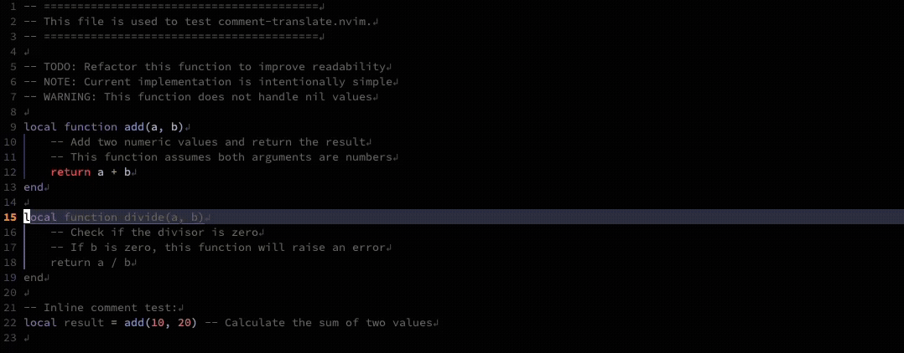

# comment-translate.nvim

[](LICENSE)
[](https://neovim.io)

Translate comments and strings directly in Neovim using hover or immersive inline views.
Supports classic translation APIs as well as LLM backends, including fully local models via Ollama.



## Why This Plugin

Many translation plugins rely on external services only. `comment-translate.nvim` is designed for teams and individuals who want a practical choice:

- Use hosted providers when you want quality and speed.
- Use local LLMs when you need stronger privacy and control.
- Keep your translation workflow inside Neovim.

## Key Benefits

- LLM translation support (`openai`, `anthropic`, `gemini`, `ollama`)
- Local LLM workflow via Ollama (no source text sent to cloud APIs)
- Hover translation for quick understanding
- Immersive inline translation mode
- Replace selected text with translation
- Tree-sitter aware comment/string detection

## Security and Privacy

This plugin gives you control over where your text goes:

- `translate_service = 'google'` or hosted `llm` providers: text is sent to the configured remote service.
- `llm.provider = 'ollama'` with the default local endpoint keeps translation local; if `llm.endpoint` is set to a remote host, text is sent there.
- Cache is in-memory only and is not persisted to disk by this plugin.

For sensitive repositories, local Ollama models are the recommended setup.

## Requirements

- Neovim 0.8+
- `curl`
- [plenary.nvim](https://github.com/nvim-lua/plenary.nvim) (required)
- Tree-sitter parser support for the languages you want to inspect (recommended)

Note: Internet is not required when you use local translation only (for example, Ollama running locally).

Parsers may come from bundled Neovim parsers, manual installation, or
parser-providing plugin setups such as `nvim-treesitter`.
`comment-translate.nvim` uses Neovim's built-in Tree-sitter APIs and does not
require the `nvim-treesitter` plugin itself.

## Installation

### lazy.nvim

```lua
{
  'noir4y/comment-translate.nvim',
  dependencies = {
    'nvim-lua/plenary.nvim',
  },
  config = function()
    require('comment-translate').setup({})
  end,
}
```

### packer.nvim

```lua
use {
  'noir4y/comment-translate.nvim',
  requires = {
    'nvim-lua/plenary.nvim',
  },
  config = function()
    require('comment-translate').setup({})
  end,
}
```

If you already manage parsers through `nvim-treesitter`, you can keep doing so.

## Usage

### Hover Translation

```lua
vim.keymap.set('n', '<leader>th', '<cmd>CommentTranslateHover<CR>', { silent = true })
```

### Immersive Translation

```vim
:CommentTranslateToggle
```

### Replace Selected Text

```vim
:CommentTranslateReplace
```

## Configuration

```lua
require('comment-translate').setup({
  target_language = 'ja',
  translate_service = 'google', -- 'google' or 'llm'

  hover = {
    enabled = true,
    delay = 500,
    auto = true,
  },

  immersive = {
    enabled = false,
  },

  cache = {
    enabled = true,
    max_entries = 1000,
  },

  targets = {
    comment = true,
    string = true,
  },

  llm = {
    provider = 'ollama', -- 'openai' | 'anthropic' | 'gemini' | 'ollama'
    model = 'translategemma:4b',
    api_key = nil, -- not required for ollama
    timeout = 20,
    endpoint = 'http://localhost:11434/api/chat', -- optional
  },

  keymaps = {
    hover = '<leader>th',
    hover_manual = '<leader>tc',
    replace = '<leader>tr',
    toggle = '<leader>tt',
  },
})
```

## LLM Provider Examples

### Local (Ollama)

```lua
require('comment-translate').setup({
  translate_service = 'llm',
  llm = {
    provider = 'ollama',
    model = 'translategemma:4b',
  },
})
```

### Hosted (OpenAI)

```lua
require('comment-translate').setup({
  translate_service = 'llm',
  llm = {
    provider = 'openai',
    api_key = vim.env.OPENAI_API_KEY,
    model = 'gpt-5.2',
  },
})
```

## Commands

- `:CommentTranslateHover`       — Display translation under cursor
- `:CommentTranslateHoverToggle` — Toggle auto hover on/off
- `:CommentTranslateReplace`     — Replace selected text with translation
- `:CommentTranslateToggle`      — Toggle immersive translation globally
- `:CommentTranslateUpdate`      — Update immersive translation for current buffer
- `:CommentTranslateSetup`       — Setup plugin with default settings
- `:CommentTranslateHealth`      — Health check, including parser availability for the buffer that invoked it

Use `:checkhealth comment-translate` for general dependency and configuration checks.
Use `:CommentTranslateHealth` from the file buffer you want to inspect when you
also want parser availability checked for that buffer.

## Development

- Format: `make fmt`
- Format check: `make fmt-check`
- Lint: `make lint`
- Test: `make test`

## License

MIT
