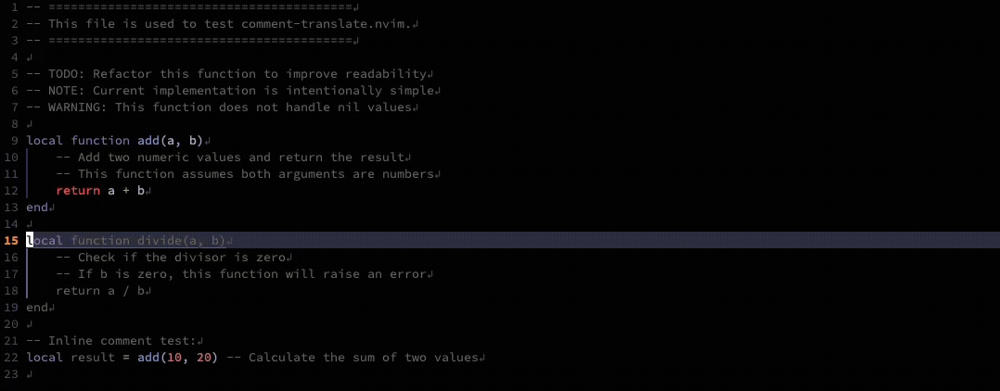

# comment-translate.nvim

[](LICENSE)
[](https://neovim.io)

Translate comments and strings directly in Neovim using hover or immersive inline views.
Supports classic translation APIs as well as LLM backends, including fully local models via Ollama.



## Why This Plugin

Many translation plugins rely on external services only. `comment-translate.nvim` is designed for teams and individuals who want a practical choice:

- Use hosted providers when you want quality and speed.
- Use local LLMs when you need stronger privacy and control.
- Keep your translation workflow inside Neovim.

## Key Benefits

- LLM translation support (`openai`, `anthropic`, `gemini`, `ollama`)
- Local LLM workflow via Ollama (no source text sent to cloud APIs)
- Hover translation for quick understanding
- Immersive inline translation mode
- Replace selected text with translation
- Tree-sitter aware comment/string detection

## Security and Privacy

This plugin gives you control over where your text goes:

- `translate_service = 'google'` or hosted `llm` providers: text is sent to the configured remote service.
- `llm.provider = 'ollama'` with the default local endpoint keeps translation local; if `llm.endpoint` is set to a remote host, text is sent there.
- API keys and source text/request bodies are passed to `curl` through stdin config, not through process arguments.
- Cache is in-memory only and is not persisted to disk by this plugin.

For sensitive repositories, local Ollama models are the recommended setup.

## Requirements

- Neovim 0.10+
- `curl`
- [plenary.nvim](https://github.com/nvim-lua/plenary.nvim) (required)
- Tree-sitter parser support for the languages you want to inspect (recommended)

Note: Internet is not required when you use local translation only (for example, Ollama running locally).

Parsers may come from bundled Neovim parsers, manual installation, or
parser-providing plugin setups such as `nvim-treesitter`.
`comment-translate.nvim` uses Neovim's built-in Tree-sitter APIs and does not
require the `nvim-treesitter` plugin itself.

## Installation

### lazy.nvim

```lua
{
  'noir4y/comment-translate.nvim',
  dependencies = {
    'nvim-lua/plenary.nvim',
  },
  config = function()
    require('comment-translate').setup({})
  end,
}
```

### packer.nvim

```lua
use {
  'noir4y/comment-translate.nvim',
  requires = {
    'nvim-lua/plenary.nvim',
  },
  config = function()
    require('comment-translate').setup({})
  end,
}
```

If you already manage parsers through `nvim-treesitter`, you can keep doing so.

## Usage

### Hover Translation

```lua
vim.keymap.set('n', '<leader>th', '<cmd>CommentTranslateHover<CR>', { silent = true })
```

### Immersive Translation

```vim
:CommentTranslateToggle
```

### Replace Selected Text

```vim
:CommentTranslateReplace
```

### Translation Targets and Parsing

Hover detection uses `targets.comment` and `targets.string`. Immersive mode
translates comments only and uses `targets.comment`. Selection replacement
translates the explicitly selected text independently of these detection settings.
With automatic hover enabled, detected text can be submitted on `CursorHold` or
`CursorHoldI`; manual hover submits it when invoked.

A successful Tree-sitter parse is authoritative: excluded targets and a buffer
with no comments are not reclassified by regex. If parsing is unavailable or fails,
regex fallback remains available and uses the target settings.
At an end-of-line insertion position, hover can resolve the preceding comment;
this does not extend string detection beyond its node. Quoted-node extraction
is restricted to the classified string node.

Injected languages are parsed on first use. A host comment or string keeps its
existing translation unit and target category, including strings used by
`vim.cmd`. In Vim language heredocs, Markdown fenced or indented code, metadata and HTML
blocks, and HTML script/style content, a missing injected parser or injection
query allows regex fallback only within the unparsed embedded content. Markdown
metadata delimiters are excluded. Hover and immersive fallback both subtract
parsed child coverage, including partial coverage on the same line. Block
comments cannot cross fallback ranges.
Hover chooses injected languages by their individual included regions, so gaps
between combined regions remain available to the host or another injected language.
Nested targets and unparsed content are clipped to their owning parent tree's
regions at each level; regions from separate parent trees are not pooled.
Immersive ancestor exclusions use those same effective owning regions.
When a nested query extends beyond provable parent ownership, its parsed overlap
is withheld from fallback rather than extracted.
A child owned by another parent does not suppress fallback in a sibling tree.
Targets spanning disjoint combined injection regions are not submitted, because
extracting their contiguous text could include intervening host code.

Regex detection is approximate and can mistake delimiters inside strings for
comments. Install the relevant parsers and injection queries for more precise
detection; target settings alone cannot resolve ambiguous syntax in unparsed text.

## Configuration Example

If `target_language` is omitted, comment-translate uses your system locale and falls back to `en`.

```lua
require('comment-translate').setup({
  target_language = 'ja', -- example override; default is system locale or 'en'
  translate_service = 'google', -- 'google' or 'llm'

  hover = {
    enabled = true,
    delay = 500,
    auto = true,
  },

  immersive = {
    enabled = false,
  },

  cache = {
    enabled = true,
    max_entries = 1000,
  },

  max_length = 5000,

  targets = {
    comment = true,
    string = true,
  },

  llm = {
    provider = 'openai', -- 'openai' | 'anthropic' | 'gemini' | 'ollama'
    model = 'gpt-5.2',
    api_key = nil, -- can also use provider-specific env vars
    timeout = 20,
    endpoint = nil, -- optional, http(s) only
    system_prompt = nil,
  },

  keymaps = {
    hover = '<leader>th',
    hover_manual = '<leader>tc',
    replace = '<leader>tr',
    toggle = '<leader>tt',
  },
})
```

## LLM Provider Examples

### Local (Ollama)

```lua
require('comment-translate').setup({
  translate_service = 'llm',
  llm = {
    provider = 'ollama',
    model = 'translategemma:4b',
  },
})
```

### Hosted (OpenAI)

```lua
require('comment-translate').setup({
  translate_service = 'llm',
  llm = {
    provider = 'openai',
    api_key = vim.env.OPENAI_API_KEY,
    model = 'gpt-5.2',
  },
})
```

## Commands

- `:CommentTranslateHover`       — Display translation under cursor
- `:CommentTranslateHoverToggle` — Toggle auto hover on/off
- `:CommentTranslateReplace`     — Replace selected text with translation
- `:CommentTranslateToggle`      — Toggle immersive translation globally
- `:CommentTranslateUpdate`      — Update immersive translation for current buffer
- `:CommentTranslateSetup`       — Setup plugin with default settings
- `:CommentTranslateHealth`      — Health check, including parser availability for the buffer that invoked it

Use `:checkhealth comment-translate` for general dependency and configuration checks.
Use `:CommentTranslateHealth` from the file buffer you want to inspect when you
also want parser availability checked for that buffer.

## Development

- Format: `make fmt`
- Format check: `make fmt-check`
- Lint: `make lint`
- Test: `make test`

For parser changes, run `make test-file FILE=tests/parser_targets_spec.lua` and
`make test-file FILE=tests/parser_spec.lua` first. Optional parsers and queries
can be supplied via `COMMENT_TRANSLATE_TEST_RTP=/path/to/runtime`. Real-parser
cases reported as `Pending` are unverified, even if also counted as `Success`.

## License

MIT
